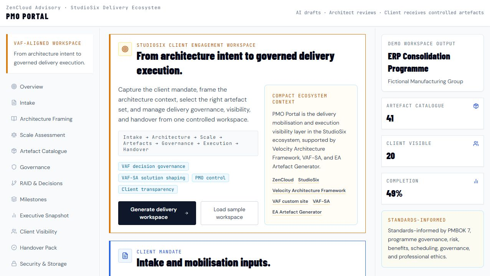
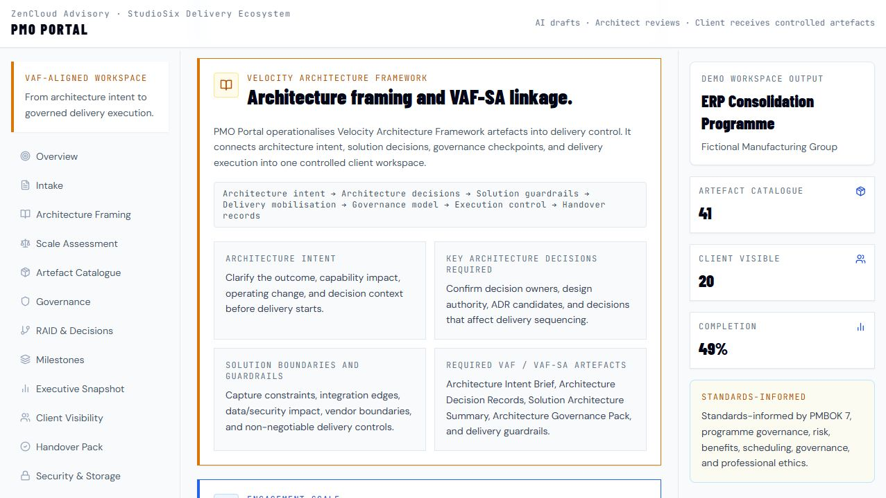

# PMO Portal

PMO Portal is a VAF-aligned StudioSix client engagement workspace for architecture framing, delivery mobilisation, governance, artefact lifecycle control, execution visibility, client transparency, and handover.

Short version:

```text
From architecture intent to governed delivery execution.
```

Operating principle:

```text
AI drafts. Architect reviews. Client receives controlled artefacts.
```

## Purpose

PMO Portal connects architecture intent, solution decisions, governance checkpoints, artefact generation, delivery execution, and client transparency into one controlled engagement workspace.

It supports the StudioSix engagement model by turning a client mandate into a structured delivery workspace: architecture context, VAF decision governance, VAF-SA solution shaping, scale assessment, artefact catalogue, mobilisation controls, governance cadence, executive visibility, and handover records.

The public demo is for demonstration only. Real client artefacts must be exported to a private client workspace, private repository, or approved client document store.

## Who It Is For

- StudioSix and ZenCloud engagement leads.
- Enterprise architects and solution architects connecting architecture decisions to delivery execution.
- Project managers and programme managers mobilising governed delivery.
- Delivery leads who need artefact control, RAID visibility, and executive reporting.
- Sponsors and reviewers who need visibility across decisions, risks, artefacts, status, and handover.

## What It Generates

PMO Portal models a controlled client workspace across:

- Client mandate intake.
- Architecture framing.
- Engagement scale assessment.
- VAF/VAF-SA artefact selection.
- Scale-based artefact catalogue.
- Delivery mobilisation brief.
- Governance model.
- RAID and decision control.
- Milestone plan.
- Executive snapshot.
- Client visibility model.
- Controlled handover pack.

Strategic workflow:

```text
Client mandate
-> Architecture framing
-> VAF decision governance
-> VAF-SA solution shaping
-> Engagement scale assessment
-> Artefact catalogue
-> AI-assisted draft generation
-> Human architecture review
-> Delivery mobilisation
-> PMO governance
-> Client-visible artefacts
-> Controlled handover
```

## Velocity Architecture Framework and VAF-SA Linkage

PMO Portal operationalises Velocity Architecture Framework artefacts into delivery control.

- **Velocity Architecture Framework** provides the architecture and decision governance method.
- **VAF-SA** provides the solution architecture practitioner method.
- **EA Artefact Generator** supports structured architecture and governance artefact production.
- **PMO Portal** turns the mandate, architecture intent, and solution guardrails into delivery mobilisation, governance, artefact control, client transparency, and handover records.

Architecture flow:

```text
Architecture intent
-> Architecture decisions
-> Solution guardrails
-> Delivery mobilisation
-> Governance model
-> Execution control
-> Handover records
```

## Workspace Modules

The current demo workspace includes:

- Overview.
- Intake.
- Architecture Framing.
- Scale Assessment.
- Artefact Catalogue.
- Governance.
- RAID & Decisions.
- Milestones.
- Executive Snapshot.
- Client Visibility.
- Handover Pack.
- Security & Storage.

## Small / Medium / Large Artefact Sets

Small project artefacts include mandate intake, architecture intent, delivery mobilisation, scope/outcomes, stakeholder map, simple delivery plan, RAID log, decision log, action register, architecture notes, weekly status, completion checklist, and handover summary.

Medium project artefacts add project charter, benefits summary, governance model, RACI and decision rights, milestone plan, dependency register, change control, architecture decision records, solution architecture summary, artefact register, communications plan, steering pack, budget summary, test and acceptance plan, readiness checklist, handover pack, and lessons learned.

Large programme artefacts add programme mandate, architecture intent, programme charter, business case summary, target outcomes, benefits realisation, roadmap, workstream structure, programme governance, steering and design authority terms, decision authority matrix, integrated master plan, resource/vendor plans, architecture governance pack, enterprise and solution architecture packs, security/risk/compliance summary, benefits dashboard, executive/workstream reports, exception reporting, transition plan, operating model impact, closure report, residual risk register, and next phase recommendations.

## Artefact Catalogue Categories

Artefacts are grouped as:

- Architecture artefacts.
- Solution architecture artefacts.
- Delivery governance artefacts.
- Execution control artefacts.
- Client reporting artefacts.
- Handover artefacts.

Each artefact record shows name, category, purpose, required/optional status, owner, lifecycle status, visibility, timing, version, client-visible flag, linked decisions, and linked risks.

## Controlled Artefact Lifecycle

Lifecycle states:

```text
Required -> Draft -> In review -> Approved -> Shared -> Locked -> Handover
```

Generation modes:

- Preview.
- Generate draft.
- Export controlled artefact.

Generated artefacts are draft outputs. They require human review before being shared, locked, or used as delivery records.

## Client Transparency Model

Every engagement should create a visible trail of artefacts, decisions, risks, assumptions, governance checkpoints, and delivery outputs. Clients can see what is being produced, why decisions were made, and where execution stands.

Client-visible items can include approved artefacts, shared decisions, RAID summary, milestone status, executive updates, and the handover pack.

Internal-only items include working drafts, private notes, sensitive analysis, internal prompts, and unapproved artefacts.

## Security and Artefact Storage Model

The public PMO Portal demo does not store real client data.

Rules:

- Public demo data only.
- Do not enter confidential, sensitive, or client-identifiable information into the public demo.
- Real engagement artefacts must be exported to a private client workspace, private repository, or approved client document store.
- Generated artefacts are controlled records.
- Client artefacts are shared only with authorised stakeholders.
- The public GitHub repo contains source code, templates, and fictional/demo examples only.
- No real client mandates, risks, decisions, reports, or generated artefacts should be committed to the public repo.

Storage workflow:

```text
Generate -> Preview -> Review -> Export -> Store privately -> Share authorised artefacts -> Lock records
```

Potential export destinations include Markdown, PDF, Word, CSV, private Git repositories, SharePoint / OneDrive, and approved client document stores. These are modelled as workflow targets only; private storage integrations are not implemented in the public demo.

## Live Demo

[PMO Portal live demo](https://zencloudau.github.io/pmi-portal/)

## Screenshots

### PMO workspace



### Architecture framing



### Controlled artefact catalogue


### Executive and governance visibility


## How It Fits the StudioSix / VAF Ecosystem

PMO Portal is the delivery mobilisation and execution visibility layer in the StudioSix engagement model.

- **ZenCloud Advisory** is the parent advisory practice for enterprise architecture, cloud, security, AI, governance, and delivery leadership.
- **StudioSix** is the architecture-led AI delivery studio of ZenCloud.
- **Velocity Architecture Framework** provides architecture and decision governance.
- **VAF-SA** provides solution architecture practitioner method.
- **EA Artefact Generator** supports structured architecture and governance artefact production.
- **PMO Portal** provides delivery execution control, client transparency, and handover records.

PMO Portal is standards-informed and is not formally certified by PMI. PMBOK 7, programme governance, risk, benefits, scheduling, governance, and professional ethics can inform governance language, but human accountability and architectural judgement remain central.

## Tech Stack

Confirmed from the current files:

- React 18.
- TypeScript.
- Vite 5.
- Tailwind CSS.
- Recharts.
- Lucide React.
- ESLint.
- GitHub Pages deployment.
- Anthropic API integration path through local/deployment environment configuration.

## How to Run Locally

Commands confirmed from `package.json`:

```bash
npm install
npm run dev
```

Build and validation scripts:

```bash
npm run build
npm run preview
npm run lint
npm run type-check
```

Environment configuration:

```bash
cp .env.example .env
```

Do not commit local environment files or API keys.

## Project Status

Prototype.

The repository has a working React/Vite structure, a live public demo, typed application flow, a VAF-aligned workspace layout, and a visible controlled artefact lifecycle model. It is not production-ready and is not a replacement for mature enterprise PMO platforms.

Before production use it would need hardened authentication, private storage, audit controls, tenant separation, data retention rules, secure API handling, and client-approved document repositories.

## Roadmap

Near-term improvements:

- Connect generated artefacts to private export destinations.
- Add explicit Markdown, Word, PDF, and CSV export flows.
- Add private workspace templates for client engagements.
- Separate public demo mode from configured private engagement mode.
- Strengthen artefact versioning, approval, locking, and handover behaviour.
- Add client-safe fictional case studies.
- Define handoff contracts with StudioSix, Velocity Architecture Framework, VAF-SA, and EA Artefact Generator.

## License

License not yet specified.
