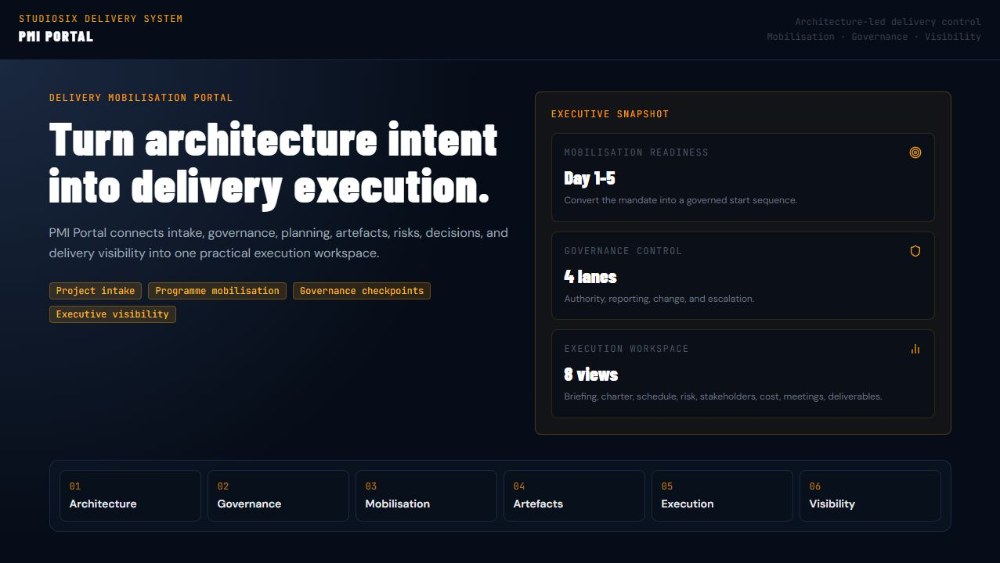
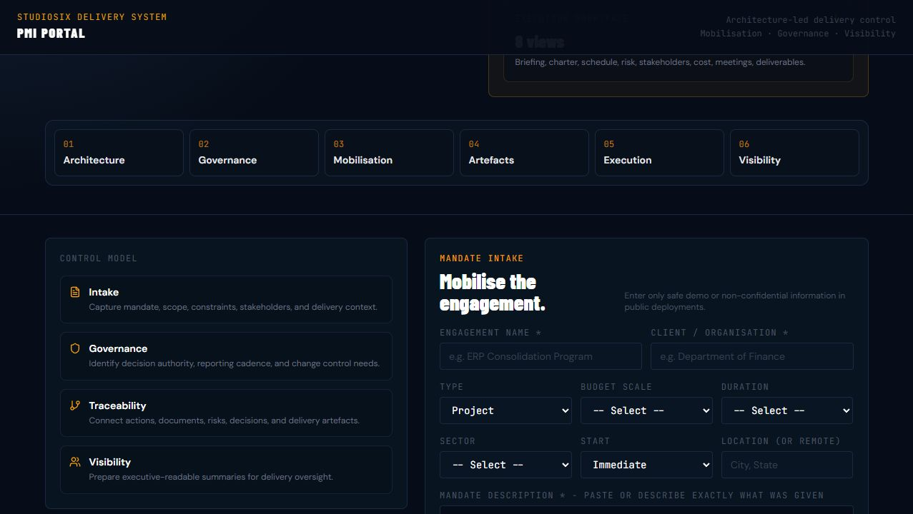
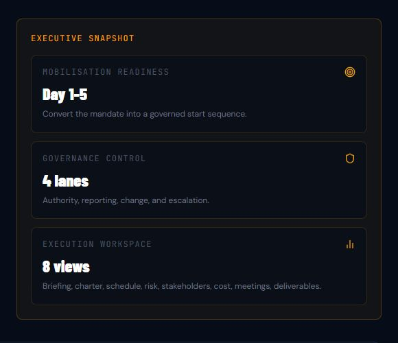

# PMI Portal

PMI Portal is an AI-assisted project and programme mobilisation portal for intake, governance, delivery planning, execution visibility, and architecture-led delivery control.

## Purpose

PMI Portal exists to turn an engagement mandate into a structured delivery starting point. It helps capture the initial context, classify the work, identify governance needs, and create a practical workspace for delivery planning and control.

The portal supports the StudioSix delivery ecosystem by connecting architecture decisions to project and programme mobilisation, governance checkpoints, and execution visibility.

## Who It Is For

- Project managers and programme managers starting a new engagement.
- Delivery leads who need a practical Day 1 mobilisation structure.
- Enterprise architects and solution architects who need delivery governance to stay connected to architecture intent.
- Consultants preparing an intake, briefing, project charter, risk view, stakeholder map, or delivery workspace.
- Sponsors and reviewers who need clearer visibility across delivery controls.

## What It Does

Based on the current repository content, PMI Portal provides:

- Engagement mandate intake for project, programme, or portfolio-component work.
- AI-assisted mandate analysis using the configured Anthropic integration.
- Briefing room output for classification, complexity, lifecycle, immediate actions, governance, stakeholders, risks, tailoring, and required documents.
- Workspace views for briefing, charter, schedule, stakeholders, risk register, cost and budget, meetings, and deliverables.
- Demo mandate support through the included Volvo example data.
- Typed project file concepts for future per-engagement JSON persistence.

The current flow is:

```text
Intake -> Analyzing -> Briefing Room -> Workspace
```

## Live Demo

[PMI Portal live demo](https://zencloudau.github.io/pmi-portal/)

## Screenshots

### Delivery mobilisation overview



### Intake and mobilisation



### Governance and execution visibility



## How It Fits the StudioSix / VAF Ecosystem

PMI Portal is the delivery mobilisation and governance layer of the StudioSix ecosystem.

It fits the delivery chain as:

```text
Architecture -> Governance -> Mobilisation -> Artefacts -> Execution -> Delivery visibility
```

- **StudioSix** provides the commercial delivery wrapper.
- **Velocity Architecture Framework** provides architecture and governance framing.
- **VAF-SA** provides the solution architecture practitioner method.
- **EA Artefact Generator** supports structured architecture artefact production.
- **PMI Portal** connects architecture intent to mobilisation, governance, planning, and execution visibility.
- **Agentic Cert** and **Learn with Claude** support learning, certification, and builder capability around the ecosystem.

PMI Portal is not positioned as a replacement for professional project management judgement. It is a structured support tool for intake, mobilisation, and governance-oriented delivery control.

## Tech Stack

Confirmed from the current files:

- React 18
- TypeScript
- Vite 5
- Tailwind CSS
- Recharts
- Lucide React
- ESLint
- GitHub Actions deployment to GitHub Pages
- Anthropic API integration through `VITE_ANTHROPIC_API_KEY`

## How to Run Locally

Commands confirmed from `package.json`:

```bash
npm install
npm run dev
```

Build and validation scripts:

```bash
npm run build
npm run preview
npm run lint
npm run type-check
```

Environment configuration:

```bash
cp .env.example .env
```

Add the required Anthropic API key value to the local `.env` file. Do not commit local environment files.

## Project Status

Prototype.

The repository has a working React/Vite structure, typed application flow, GitHub Pages deployment configuration, and a live public URL. It is not yet product-ready because it still needs clearer screenshots, stronger public packaging, safer production API handling, and evidence of the full workflow operating reliably outside demo use.

## Roadmap

Near-term improvements:

- Add additional screenshots after briefing room and workspace states are available without local API configuration.
- Clarify demo-only versus configured-AI behaviour on the public site.
- Add export/import handling for project files.
- Strengthen project charter, risk register, stakeholder, and deliverables outputs.
- Define the handoff contract between PMI Portal, VAF, and EA Artefact Generator.
- Add client-safe case study examples without exposing confidential delivery information.

## Security and Data Notes

The current repository includes an Anthropic API integration path and an `.env.example` file. Local secrets should remain in `.env` or deployment secrets and must not be committed.

The public demo should be treated as a prototype and demonstration environment. Users should avoid entering confidential client, commercial, personal, or regulated data unless the deployment has been explicitly reviewed and approved for that use.

## License

Private — ZenCloud Consulting. Not for redistribution.
