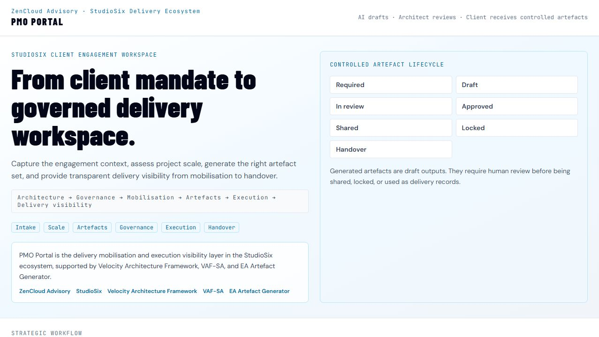
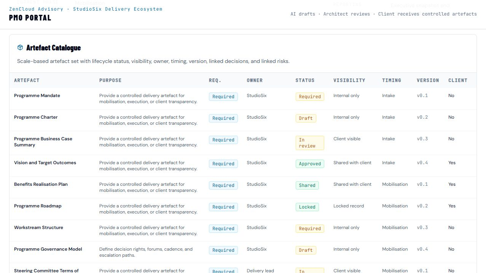
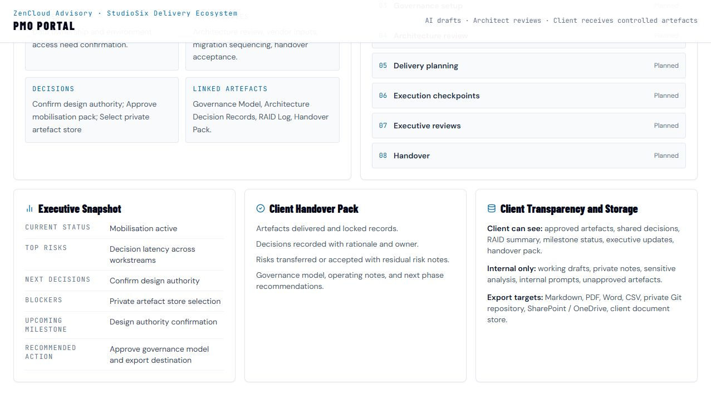

# PMO Portal

PMO Portal is the StudioSix client engagement workspace for delivery mobilisation, governance, artefact generation, execution visibility, controlled artefact sharing, and handover.

## Purpose

PMO Portal exists to turn a client mandate into a governed delivery workspace.

It helps capture the engagement context, assess the scale and type of work, select the right project or programme artefact set, draft delivery outputs, track review status, and provide controlled visibility from mobilisation through handover.

Core operating principle:

```text
AI drafts. Architect reviews. Client receives controlled artefacts.
```

The public repository and live demo are for product demonstration only. Real engagement artefacts must be exported to a private client workspace, private repository, or approved client document store.

## Who It Is For

- StudioSix and ZenCloud engagement leads shaping client delivery.
- Project managers and programme managers starting a new engagement.
- Delivery leads who need mobilisation structure, governance checkpoints, and executive reporting.
- Enterprise architects and solution architects who need delivery execution to stay connected to architecture intent.
- Sponsors and reviewers who need visibility across decisions, risks, artefacts, and handover.

## What It Generates

PMO Portal models a controlled workspace across:

- Client mandate intake.
- Engagement scale assessment.
- Scale-based artefact set selection.
- Delivery mobilisation brief.
- Governance model.
- RAID and decision control.
- Milestone plan.
- Executive snapshot.
- Controlled artefact catalogue.
- Client handover pack.

The intended workflow is:

```text
Client mandate
-> Engagement scale assessment
-> Artefact set selection
-> AI-assisted draft generation
-> Human review
-> Controlled private storage
-> Client-visible sharing
-> Governance updates
-> Handover pack
```

## Scale-Based Artefact Sets

Small project artefacts include the mandate brief, delivery mobilisation brief, scope and outcomes summary, stakeholder map, simple delivery plan, RAID log, decision log, action register, architecture notes, status reporting, completion checklist, and handover summary.

Medium project artefacts add project charter, benefits summary, governance model, RACI and decision rights, milestone plan, dependency register, change control, architecture decision records, solution architecture summary, steering pack, budget summary, acceptance plan, readiness checklist, handover pack, and lessons learned.

Large programme artefacts add programme mandate, programme charter, business case summary, benefits realisation, roadmap, workstream structure, steering and design authority terms of reference, integrated master plan, resource and vendor plans, architecture governance pack, enterprise and solution architecture packs, security/risk/compliance summary, benefits dashboard, executive and workstream status reports, exception reporting, transition plan, operating model impact, closure report, residual risk register, and next phase recommendations.

## Controlled Artefact Lifecycle

PMO Portal treats artefacts as controlled delivery records, not one-off generated text.

Lifecycle states:

```text
Required -> Draft -> In review -> Approved -> Shared -> Locked -> Handover
```

Artefact records show:

- Artefact name.
- Purpose.
- Required or optional status.
- Owner.
- Lifecycle status.
- Visibility state.
- Timing.
- Version.
- Client-visible flag.
- Linked decisions.
- Linked risks.

Generated artefacts are draft outputs. They require human review before being shared, locked, or used as delivery records.

## Client Transparency Model

Every engagement should create a visible trail of artefacts, decisions, risks, assumptions, governance checkpoints, and delivery outputs. Clients can see what is being produced, why decisions were made, and where execution stands.

Client-visible items can include:

- Approved artefacts.
- Shared decisions.
- RAID summary.
- Milestone status.
- Executive updates.
- Handover pack.

Internal-only items include:

- Working drafts.
- Private notes.
- Sensitive analysis.
- Internal prompts.
- Unapproved artefacts.

## Security and Artefact Storage Model

The public PMO Portal demo does not store real client data.

Rules:

- Public demo data only.
- Do not enter confidential, sensitive, or client-identifiable information into the public demo.
- Real engagement artefacts must be exported to a private client workspace, private repository, or approved client document store.
- Generated artefacts are controlled records.
- Client artefacts are shared only with authorised stakeholders.
- The public GitHub repo contains source code, templates, and fictional/demo examples only.
- No real client mandates, risks, decisions, reports, or generated artefacts should be committed to the public repo.

Current export model:

```text
Generate -> Preview -> Export -> Store privately
```

Potential controlled destinations include Markdown, PDF, Word, CSV, private Git repositories, SharePoint / OneDrive, and approved client document stores.

## Live Demo

[PMO Portal live demo](https://zencloudau.github.io/pmi-portal/)

## Screenshots

### Delivery mobilisation intake



### Controlled artefact catalogue



### Executive and governance visibility



## How It Fits the StudioSix / VAF Ecosystem

PMO Portal is the delivery mobilisation and execution visibility layer in the StudioSix engagement model.

- **ZenCloud Advisory** is the parent advisory practice for enterprise architecture, cloud, security, AI, governance, and delivery leadership.
- **StudioSix** is the architecture-led AI delivery studio of ZenCloud.
- **Velocity Architecture Framework** provides the architecture and decision governance method.
- **VAF-SA** provides the solution architecture practitioner method.
- **EA Artefact Generator** supports structured architecture and governance artefact production.
- **PMO Portal** turns the mandate and architecture intent into delivery mobilisation, artefact control, execution visibility, and handover.

Strategic workflow:

```text
Architecture -> Governance -> Mobilisation -> Artefacts -> Execution -> Delivery visibility -> Client transparency -> Handover
```

PMO Portal is standards-informed and is not formally certified by PMI. PMBOK 7 and The Standard for Program Management can inform governance language, but human accountability and architectural judgement remain central.

## Tech Stack

Confirmed from the current files:

- React 18.
- TypeScript.
- Vite 5.
- Tailwind CSS.
- Recharts.
- Lucide React.
- ESLint.
- GitHub Pages deployment.
- Anthropic API integration path through local/deployment environment configuration.

## How to Run Locally

Commands confirmed from `package.json`:

```bash
npm install
npm run dev
```

Build and validation scripts:

```bash
npm run build
npm run preview
npm run lint
npm run type-check
```

Environment configuration:

```bash
cp .env.example .env
```

Do not commit local environment files or API keys.

## Project Status

Prototype.

The repository has a working React/Vite structure, a live public demo, typed application flow, and a visible controlled artefact lifecycle model. It is not production-ready and is not a replacement for mature enterprise PMO platforms.

Before production use it would need hardened authentication, private storage, audit controls, tenant separation, data retention rules, secure API handling, and client-approved document repositories.

## Roadmap

Near-term improvements:

- Connect generated artefacts to private export destinations.
- Add explicit Markdown, Word, PDF, and CSV export flows.
- Add private workspace templates for client engagements.
- Separate public demo mode from configured private engagement mode.
- Strengthen artefact versioning, approval, locking, and handover behaviour.
- Add client-safe fictional case studies.
- Define handoff contracts with StudioSix, Velocity Architecture Framework, VAF-SA, and EA Artefact Generator.

## License

License not yet specified.
